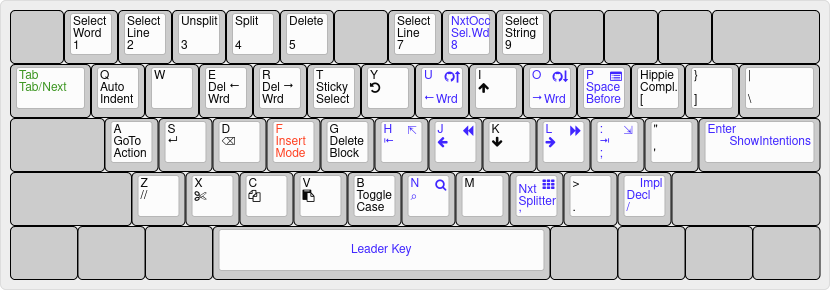
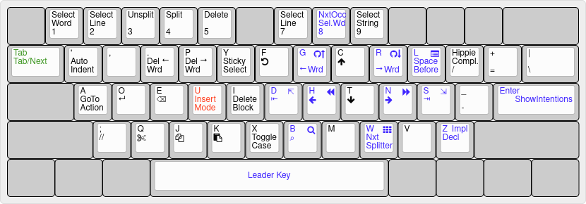

ErgoKeys
========

A modal keybinding for IntelliJ family of IDEs (like vim), but based on command frequency and ergonomics.
Inspired by [xah-fly-keys](https://github.com/xahlee/xah-fly-keys), independently implemented as a plugin for IntelliJ.

    Shift-Space  activate "Command Mode"
    Alt-Space    activate "Command Mode"
    F (qwerty)   activate "Insert Mode"
    U (dvorak)   activate "Insert Mode"

**QWERTY**

*[source for QWERTY](http://www.keyboard-layout-editor.com/#/gists/a8580928ecd9d38a04dded8eb23be192)*

**Dvorak**

*[source for Dvorak](http://www.keyboard-layout-editor.com/#/gists/79024072711c13021d73ba30117bf79b)*

## Key Bindings

Action                        | QWERTY | Dvorak
------------------------------|--------|-------
EditorLeft                    |   J    |   H
EditorRight                   |   L    |   N
EditorUp                      |   I    |   C
EditorDown                    |   K    |   T
EditorPreviousWord            |   U    |   G
EditorNextWord                |   O    |   R
StartOfLineOrParagraph        |   H    |   D
EndOfLineOrParagraph          |   ;    |   S
NextSplitter                  |   ,    |   W
Find                          |   N    |   B
GotoDeclaration               |   /    |   Z
EditorCut                     |   X    |   Q
EditorCopy                    |   C    |   J
EditorPaste                   |   V    |   K
AutoIndentLines               |   Q    |   '
EditorDeleteToWordStart       |   E    |   .
EditorDeleteToWordEnd         |   R    |   P
EditorToggleStickySelection   |   T    |   Y
$Undo                         |   Y    |   F
GotoAction                    |   A    |   A
EditorEnter                   |   S    |   O
EditorBackSpace               |   D    |   E
InsertMode                    |   F    |   U
EditorSelectWord              |   1    |   1
EditorSelectLine              |   2    |   2
UnsplitAll                    |   3    |   3
SplitVertically               |   4    |   4
$Delete                       |   5    |   5
EditorSelectLine              |   7    |   7
EditorSelectWord              |   8    |   8
SelectString                  |   9    |   9
DeleteCurrentCodeBlock        |   G    |   I
EditorToggleCase              |   B    |   X
HippieCompletion              |   [    |   /
ActivateInsertModeSpaceBefore |   P    |   L
CommentByLineComment          |   Z    |   ;
EditorTab                     |  TAB   |  TAB
NextTemplateVariable          |  TAB   |  TAB
ExpandLiveTemplateByTab       |  TAB   |  TAB
NextParameter                 |  TAB   |  TAB
BraceOrQuoteOut               |  TAB   |  TAB
EditorIndentSelection         |  TAB   |  TAB
EditorChooseLookupItemReplace |  TAB   |  TAB
EditorChooseLookupItem        |  TAB   |  TAB
EditorEnter                   | ENTER  | ENTER
EditorChooseLookupItem        | ENTER  | ENTER
EditorEscape                  | ESCAPE     | ESCAPE
EditorBackSpace               | BACK_SPACE | BACK_SPACE
Back                          | L + J      |  L + H
Forward                       | L + L      |  L + N
GotoImplementation            | L + /      |  L + Z
FindInPath                    | L + N      |  L + B
Switcher                      | L + ,      |  L + W
FileStructurePopup            | L + P      |  L + L
EditorTextStart               | L + H      |  L + D
EditorTextEnd                 | L + ;      |  L + S
VcsShowPrevChangeMarker       | L + U      |  L + G
VcsShowNextChangeMarker       | L + O      |  L + R
SelectNextOccurrence          | L + 8      |  L + 8
ShowIntentionActions          | L + ENTER  |  L + ENTER
